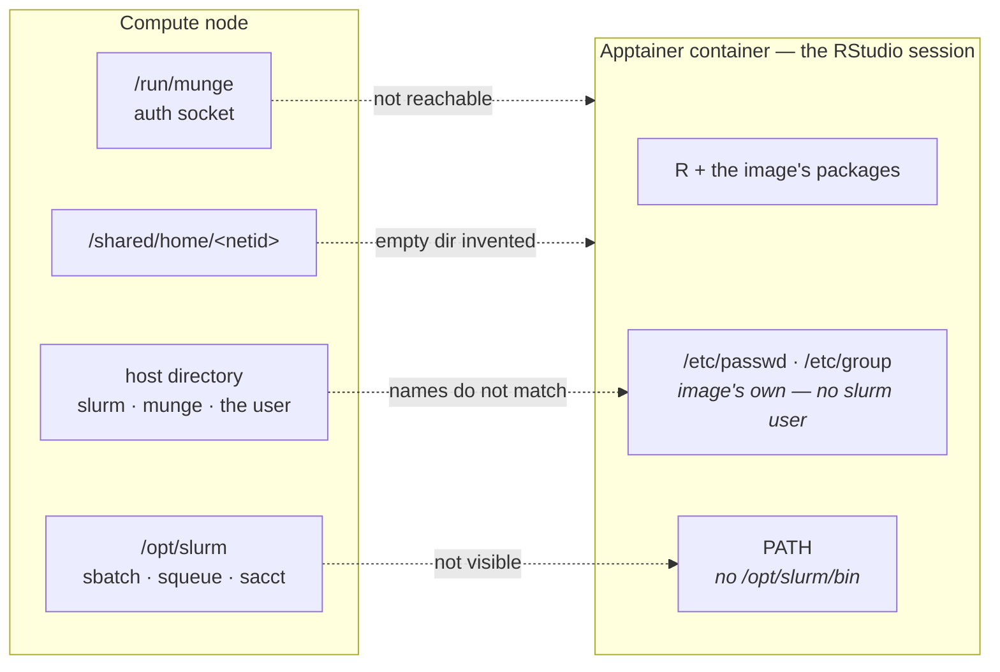
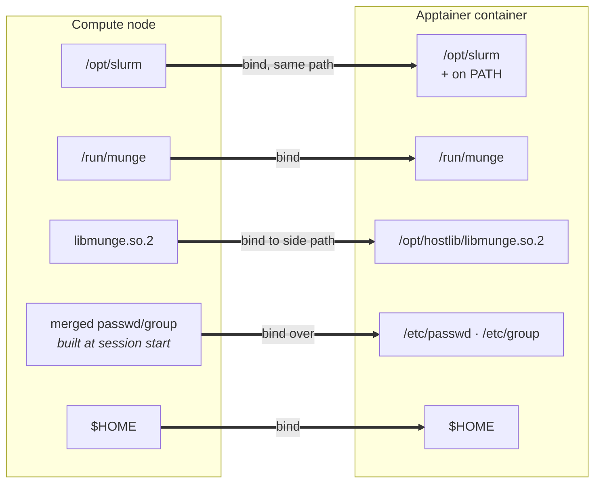
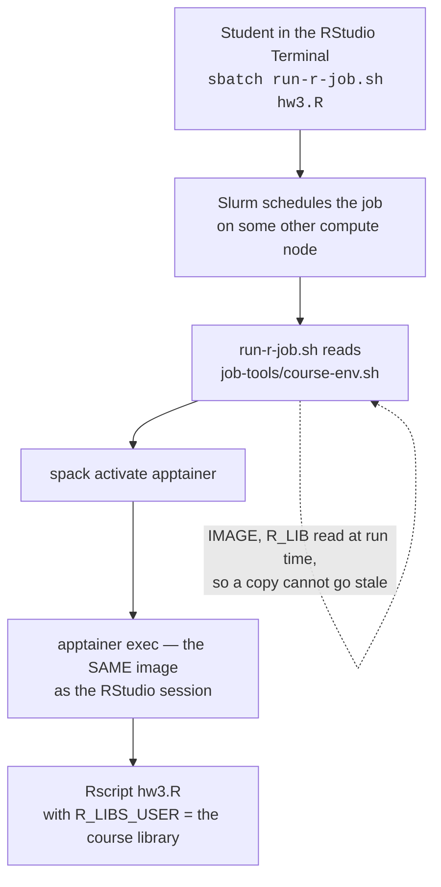

# Slurm from inside the container

**Companion to [README.md](README.md).** The README explains how this app runs RStudio in an
Apptainer container — the session directory, `SING_BINDS`, logging, authentication. This file covers
one addition to that: letting a session **submit and query Slurm jobs from inside the container**, so
students can run batch work in the same environment they are working in.

**Mostly this is not a setup procedure — it is a description of how the pieces fit together.** Almost
nothing here is done per course. The machinery lives in [`template/script.sh.erb`](template/script.sh.erb); a course turns it on
with one attribute on its form, and the rest happens at session start.

Read it when enabling Slurm for a course, or when something about it has broken and the symptom does
not obviously point anywhere.

Worked example: [STAT 139](https://github.com/Harvard-ATG/ood-misc-runbooks/blob/main/courses/stat139.md)
in the runbooks repo.

## What you actually configure

Three values on the sub-app's `.yml.erb`, and nothing else:

| Attribute | What it does |
|---|---|
| `slurm_enabled: "true"` | the switch. Turns on everything described below |
| `imagefile` | which image, and therefore **which R** a job runs |
| `r_libpath` | where the course's packages live |

The last two already exist for any course with a shared library; `slurm_enabled` is the only new one.

> **List every one of them under `form:` as well as `attributes:`.** OOD passes only `form:`-listed
> attributes into `context`, so an attribute in `attributes:` alone makes every guard silently
> evaluate false — no error, the block just does not run. A hard-coded value listed under `form:` is
> still hidden from the user in the dashboard.

That is the whole per-course setup. The rest of this page is what that switch turns on.

## The problem

A container is a sealed filesystem with its own idea of who exists. The scheduler lives outside it.
So from inside, three separate things are missing, and each fails differently:

| Missing | Symptom |
|---|---|
| the Slurm binaries | `sbatch: command not found` |
| the munge socket | authentication failures against `slurmctld` |
| a usable `/etc/passwd` | `Invalid user for SlurmUser slurm` — **every** Slurm command refuses to run |

None of these is a permissions problem, which is what makes them confusing. The container is not
being denied access; it cannot see the scheduler, cannot authenticate to it, and does not share its
idea of who people are.



Everything the container needs is a few centimetres away on the same machine, and none of it is
reachable. The setup below hands each piece across the boundary, then makes it findable.



## What the switch turns on

All of this lives in [`template/script.sh.erb`](template/script.sh.erb) and runs at session start. **You do not do any of it per
course** — it is here so that when something breaks, the shape of it is on record.

Sub-apps that do not opt in are byte-for-byte unchanged.

### A passwd and group the Slurm client can use

Start from the image's own, then ask the **host** to resolve what the image lacks:

```bash
apptainer exec "$_IMG" cat /etc/passwd > "$WORKING_DIR/passwd"
apptainer exec "$_IMG" cat /etc/group  > "$WORKING_DIR/group"

getent passwd slurm munge "$(id -un)" >> "$WORKING_DIR/passwd"
getent group  slurm munge              >> "$WORKING_DIR/group"
for _g in $(id -Gn); do getent group "$_g" >> "$WORKING_DIR/group"; done
```

> **`$(id -un)` is not optional.** Binding a file over `/etc/passwd` *replaces* the entry apptainer
> injects for the caller — omit it and the session has a uid with no name.

**Optional — resolve everyone in the course.** Binding over `/etc/passwd` means only the records in
that file resolve, so by default a user sees their own netid in `squeue` and everyone else as a bare
number. To let staff see whose job is whose, add the course roster:

```bash
_ROSTER="<%= course_roster %>"   # built in ERB - see the warning below
[ -n "$_ROSTER" ] && getent passwd $_ROSTER >> "$WORKING_DIR/passwd"
```

> **Enumerate the group on the portal, not the compute node.** `getent group <name>` returns the full
> member list on the portal and a near-empty one on a compute node — measured: **1 name against 179**.
> SSSD enumeration is off. `script.sh.erb` runs on the compute node, so build the *list* in ERB (which
> is evaluated on the portal) and do the per-name `getent passwd` lookups on the node. Per-name
> lookups work everywhere.

Derive the group from the course folder's own group ownership rather than adding an attribute for it.

### How authentication actually works

Worth walking through, because "bind the munge socket in" sounds like a shortcut around security and
is the opposite.

Start RStudio. OOD submits a Slurm job; that job lands on a compute node and runs
[`template/script.sh.erb`](template/script.sh.erb) **outside** any container, as the person who
launched it. The container comes later. So by the time RStudio exists, the process already carries a
real uid and a real group list, handed to it by the node.

Now that session's Terminal runs `sbatch`. Slurm has to answer one question: **is this really uid
5163, or is something claiming to be?**

It does not take the client's word for it. `sbatch` opens a unix socket on the node -
`/run/munge/munge.socket.2` - and asks the local `munged` daemon to vouch for it. `munged` reads the
uid and gid **from the kernel's view of the connecting process**, not from anything the process says
about itself, and returns a short-lived credential signed with a key that only the cluster's daemons
hold. `slurmctld` verifies that signature against its own `munged` and believes the uid inside.

Two things follow, and they are the reason this is safe:

| | |
|---|---|
| **The container never asserts an identity** | It asks the node to state one. The claim comes from the kernel, on the real uid the process already had |
| **The signing key never enters the container** | Only the socket is bound. A credential can be requested; none can be forged |

So the three binds are doing three different jobs, and it is worth keeping them apart:

| Bind | What it is | What it would mean if you got it wrong |
|---|---|---|
| `/run/munge` | the **door** - where to ask for a credential | no answer; authentication failures against `slurmctld` |
| `libmunge` | the **phrasebook** - the library that knows how to ask | the client cannot make the call at all |
| `/etc/passwd`, `/etc/group` | the **map** - words to numbers, so `SlurmUser=slurm` resolves | the client refuses to start, before it authenticates anything |

**A bound socket is not a granted permission.** Reaching `munged` gets a statement of who the process
already is. It cannot make a process into someone else, and a student's job is scheduled against
their own uid whether or not any of this is bound - which is also why removing a name from
`/etc/passwd` would not stop them submitting, only stop `squeue` printing a name.

### The binds

| Bind | Why |
|---|---|
| `/opt/slurm` | client binaries and libraries — at the **same path**, because Slurm's plugins `dlopen` by absolute path |
| `/run/munge` | the authentication socket |
| `$MUNGELIB:/opt/hostlib/libmunge.so.2` | the auth library, on a side path so it does not shadow the image's own `/usr/lib64` |
| `$WORKING_DIR/passwd:/etc/passwd` | from step 2 |
| `$WORKING_DIR/group:/etc/group` | from step 2 |
| `$HOME` | so the user's files and personal package library are visible to a job |

Resolve the munge library at run time — the patch level differs between machines:

```bash
MUNGELIB=$(readlink -f /usr/lib64/libmunge.so.2)
```

### Making the bound pieces findable

Binding makes files **exist**; these make them **discoverable**. A bind with nothing on `PATH` is
indistinguishable from "command not found".

```bash
export APPTAINERENV_APPEND_PATH="/opt/slurm/bin"
export APPTAINERENV_LD_LIBRARY_PATH="/opt/slurm/lib:/opt/hostlib:${LD_LIBRARY_PATH}"
export APPTAINERENV_SLURM_CONF="/opt/slurm/etc/slurm.conf"
```

> **RStudio rebuilds the environment per session**, so the above never reaches a Terminal pane or the
> R console. Set PATH again in the two places it does not rebuild: a `/etc/profile.d/` drop-in bound
> in for interactive shells, and an `export PATH=` inside the generated `rsession.sh` so
> `system("sbatch …")` works from the console.

## Where course-managed scripts live

Enabling Slurm gets a student a working `sbatch`. It does not tell them what to type — a job still has
to activate spack for `apptainer`, run the right image, and point the language at the course library,
and two of those values live on the sub-app form where no student can see them.

So there is a **convention for where course-facing scripts are kept**, and it is deliberately
course-agnostic: same folder name, same layout, same instruction to a student, whatever the course or
the language. Only the two values inside differ.

```
<course shared folder>/job-tools/
├── run-r-job.sh     the wrapper       — a Python course would carry run-py-job.sh
├── course-env.sh    the two values    — same file, same name, every course
└── README.md        student instructions
```

**Why the course folder and not each user's home.** A file in a home has to be two things at once: the
class's supported path *and* that person's own file. Those want opposite maintenance rules — refresh
it and you destroy their edits; preserve their edits and it silently goes stale. The first version of
this wrote into `$HOME` and told the student, four lines apart, that the file "cannot drift" and was
"never overwritten". Only one of those can be true.

**Why the teaching staff can write it and students cannot.** Students are expected to modify their
batch jobs — that is often the point of the course — so something has to stay correct no matter what
anyone edits. Keeping the canonical copy in a folder students can read but not write means there is
always a known-good version one `cp` away.

Two **independent** checks decide what a session writes — not an `if/elif` chain, because one person
can be both staff and an admin:

| Launcher | Course folder | Their home |
|---|---|---|
| staff / faculty (`[ -w "$COURSE_DIR" ]`) | refreshed every launch | nothing |
| admin / dev team (role from the sub-app) | untouched | a course-named copy, for testing |
| student | untouched | **nothing** |

`[ -w ]` rather than group membership: writing is what actually matters, and it needs no staff list.
The admin branch is not a nicety — the dev team usually launches a course *before* its folder exists
or before Grouper has propagated, so the first check does nothing and there would be nothing to test
with.

**Split the mechanism from the values.** A copy freezes whatever is inside it, so put the *values* in
a file it reads at run time:

```bash
# course-env.sh - generated, never hand-written
IMAGE=/shared/apptainerImages/<course>.sif
R_LIB=<course folder>/R/x86_64-pc-linux-gnu-library/4.5
```

```bash
# in the wrapper - pointer substituted at generation, values as a fallback
IMAGE=@IMAGE@
R_LIB=@RLIBS@
COURSE_ENV=@COURSE_ENV@
[ -r "$COURSE_ENV" ] && . "$COURSE_ENV"
```

A copy taken in week 2 then uses week 9's image with no action from the student. The baked values
cover the case where that file does not exist yet — a course tested before its folder is provisioned,
which is how every course starts.

**How a student's job ends up with the same R as their session:**



**What students are told:**

```bash
cp ~/<canvas id>/job-tools/run-r-job.sh .
sbatch run-r-job.sh my_script.R
sbatch -c 4 -t 02:00:00 -J hw3 run-r-job.sh my_script.R
```

> **Order matters, and getting it wrong is silent.** Options must come *before* the script name. Put
> them after and they are passed to the script instead: the job completes, the option is ignored, and
> nothing says so. Have the wrapper warn.

No configuration is needed to name anything — OOD names the session's Slurm job after the sub-app
file, so `${SLURM_JOB_NAME##*/}` is the sub-app name.

## Troubleshooting

<details>
<summary><strong>Every Slurm command fails: <code>Invalid user for SlurmUser slurm, ignored</code></strong></summary>

Binds are all in place and every command still fails with `fatal: Unable to process configuration
file`.

**Why:** name resolution, not permissions. `slurm.conf` names `SlurmUser=slurm` and the image's
`/etc/passwd` has no such user, so the client refuses to start at all.

**Solution:** the merged passwd/group described above. And remember to append the launching user.
</details>

<details>
<summary><strong>The whole injection block silently does nothing</strong></summary>

The sub-app launches normally; the log shows only the original binds.

**Why:** the attribute is under `attributes:` but not `form:`, so `context` never receives it and
every guard evaluates false.

**Solution:** list it under `form:` too. Easiest mistake to make, hardest to spot — there is no error.
</details>

<details>
<summary><strong><code>sbatch: command not found</code>, with the binds demonstrably present</strong></summary>

`ls /opt/slurm/bin` inside the container shows the binaries, but `sbatch` is not found.

**Why:** RStudio rebuilds the environment per session, so `APPTAINERENV_APPEND_PATH` never reaches
the Terminal or console. `/usr/lib/rstudio-server/bin` goes missing the same way.

**Solution:** set PATH in the `profile.d` drop-in *and* in `rsession.sh` — see *Making the bound pieces findable*.
</details>

<details>
<summary><strong>Batch jobs cannot see anything in the user's home</strong></summary>

Absolute paths into a home vanish inside a job; the same file by relative name works.

**Why:** apptainer is not mounting the real home — it fabricates an **empty** directory in its place.
The compute nodes report homes as `/home/<netid>` while the real path is `/shared/home/<netid>`, so
apptainer has nothing valid to mount. Relative paths work because the *working directory* is bound,
which is why this goes unnoticed.

**Solution:** bind it explicitly, guarded so an unset `$HOME` cannot produce a malformed argument:

```bash
[ -n "$HOME" ] && [ -d "$HOME" ] && _BINDS="$_BINDS -B $HOME"
```

This also hides the user's **own** package library at `$HOME/R/...` from every job. Not specific to
any one course: any apptainer app doing a plain `apptainer exec` on these nodes has it.
</details>

<details>
<summary><strong>A job finds the course library and still cannot load from it</strong></summary>

`--export=ALL` carries `R_LIBS_USER`, so `.libPaths()` is correct — and then:

```
Error: package or namespace load failed for 'digest' in dyn.load(...):
  undefined symbol: NO_REFERENCES
package 'digest' was built under R version 4.5.0
```

**Why:** the compute node has its own R at `/usr/lib64/R`; the course packages are compiled against
the **container's** R.

**Solution:** run the job through the image. The environment variable gives the job the *address*; the
container gives it an R that can *read* what is there. **Same library path is not the same R** — that,
not convenience, is why the wrapper exists.
</details>

## Reference

- OOD passes **only `form:`-listed attributes** into `context`.
- Files in `template/` are staged into `${JOBROOT}`; `before.sh` sets `export JOBROOT=$PWD`.
- Use the **shared** image path, not a node-local cache — the job lands on a different node.
- `R_LIBS_USER` may point at a library that does not exist yet; R drops missing `.libPaths()` entries
  silently, so provisioning order does not matter.
- **The portal cannot submit Slurm jobs** (*Unable to contact slurm controller*). Submit from the head
  node or an app session.
- **`sudo` resets PATH** — use `/opt/slurm/bin/sbatch` under `sudo -u`.
- Group enumeration works on the portal, not on compute nodes; per-name lookups work everywhere.
