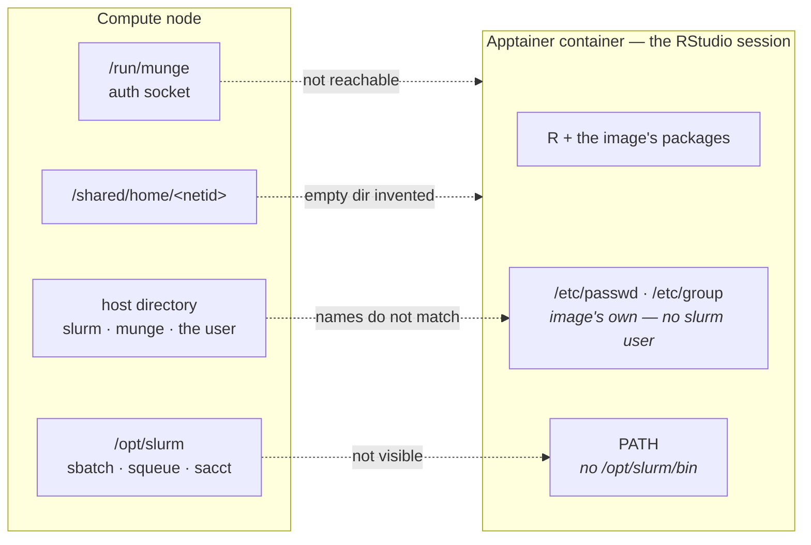
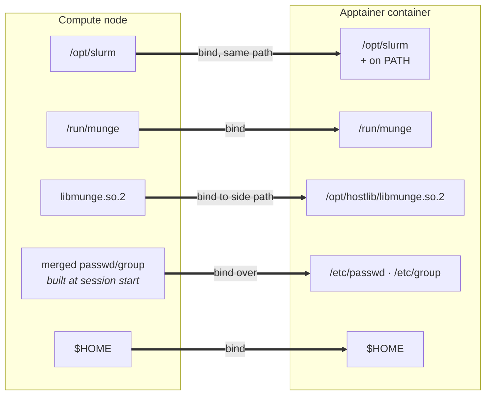
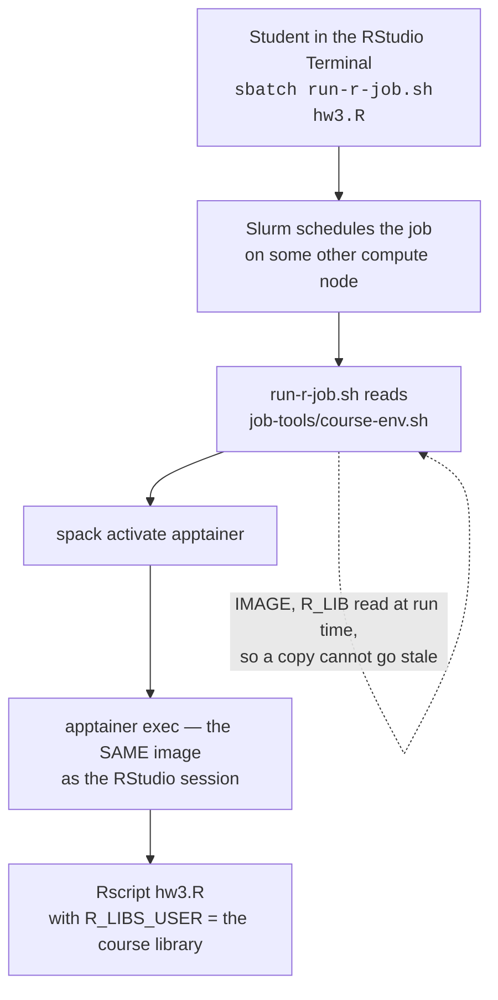

# Slurm from inside the container

**Companion to [README.md](README.md).** The README covers how this app runs RStudio in an apptainer
container: the session directory, `SING_BINDS`, logging, authentication. This file covers one
addition. It lets a session submit and query Slurm jobs from inside the container, so students can run
batch work in the same environment they are already working in.

Most of what follows is not a procedure. Almost nothing here is done per course. The machinery lives
in [`template/script.sh.erb`](template/script.sh.erb) and runs on its own at session start. A course
turns the machinery on with one attribute on its form.

Read this when enabling Slurm for a course, or when something has broken and the symptom does not
point anywhere obvious.

Worked example: [STAT 139](https://github.com/Harvard-ATG/ood-misc-runbooks/blob/main/courses/stat139.md).

## What you configure

Three values on the sub-app's `local/<course>.yml.erb`, and nothing else:

| Attribute | What it does |
|---|---|
| `slurm_enabled: "true"` | the switch. Turns on everything below |
| `imagefile` | which image, and so which R a job runs |
| `r_libpath` | where the course's packages live |

`imagefile` and `r_libpath` already exist for any course with a shared library. `slurm_enabled` is the
only new one.

> **List all three under `form:` as well as `attributes:`.** OOD only passes `form:`-listed attributes
> into `context`. An attribute listed under `attributes:` alone makes every guard evaluate false, with
> no error and no log line - the block simply does not run. A hard-coded value listed under `form:` is
> still hidden from the user in the dashboard.

That is the whole per-course setup. The rest of this page describes what the switch turns on.

## Why anything is needed

RStudio runs in an apptainer container. Inside the container is R, the packages in the image, and not
much else. Giving every student the same R is the point of a container.

Running Slurm jobs from inside a container is the problem. Almost everything a Slurm job needs sits
outside the container, on the compute node. The work is bringing each piece in.

Three things are missing inside the container:

1. **The Slurm commands.** Without the Slurm commands (like `sbatch`, `squeue`, `sacct`), RStudio in
   the container can never see or talk to Slurm. The Slurm commands weren't originally part of the
   image, so when you try to use the Slurm commands you would get `command not found`. The Slurm
   commands live on the compute node, in `/opt/slurm/bin`.

2. **The munge socket.** Munge is the service Slurm uses to check identity. Without munge, Slurm can
   never confirm who sent a job, and the job is rejected before it starts. Munge also runs on the
   compute node, and listens on a socket at `/run/munge`.

3. **The name-to-number maps.** Humans write and read names. Machines write and read numbers.
   `/etc/passwd` and `/etc/group` are the two files that convert between the two. Every service that
   needs to know who someone is reads them.

   `/etc/passwd` holds one account per line. `/etc/group` holds one group per line. Each line starts
   with a name, and carries the number the name stands for.

   Here is an account. A student named Maya Chen has the netid `mch247`:

   ```
   mch247:*:54321:1025173:Maya Chen:/shared/home/mch247:/bin/bash
   ```

   The name is `mch247`. The number is `54321`.

   Here is a group:

   ```
   canvas170320-staff-1168564:*:1168564:jgx375,zil005
   ```

   The name is `canvas170320-staff-1168564`. The number is `1168564`. The members are `jgx375` and
   `zil005`. (The student above is made up. The group is real.)

   Slurm has an account of its own. Slurm's config says `SlurmUser=slurm`. When a Slurm command
   starts, the command looks up `slurm` in `/etc/passwd` to find the number.

   The container image ships its own `/etc/passwd`. The image's copy lists only the accounts the image
   was built with - no `slurm`, and nobody from Harvard. The lookup finds nothing, and no Slurm
   command runs at all.

None of the three is a permissions problem. Nothing is refusing access. The Slurm commands, munge, and
the account names are all on the compute node, and the container cannot see the compute node.



Everything the container needs is a few centimetres away on the same machine, and none of it is
reachable. The setup below hands each piece across the boundary, then makes it findable.



## What the switch turns on

Everything below lives in [`template/script.sh.erb`](template/script.sh.erb) and runs at session
start. **None of it is done per course.** It is written down so that when something breaks, the shape
of the machinery is on record.

A sub-app that does not turn the switch on is byte-for-byte unchanged.

### A passwd and group the Slurm client can use

The container needs a `/etc/passwd` that lists the accounts Slurm looks up. Start from the image's own
file, then ask the compute node for the accounts the image is missing.

`getent` is the command that asks the node. Give `getent` a name, and it returns the line for that
name:

```bash
apptainer exec "$_IMG" cat /etc/passwd > "$WORKING_DIR/passwd"
apptainer exec "$_IMG" cat /etc/group  > "$WORKING_DIR/group"

getent passwd slurm munge "$(id -un)" >> "$WORKING_DIR/passwd"
getent group  slurm munge              >> "$WORKING_DIR/group"
for _g in $(id -Gn); do getent group "$_g" >> "$WORKING_DIR/group"; done
```

The new file is then bound over the container's own `/etc/passwd`.

> **`$(id -un)` is not optional.** Apptainer writes an entry for whoever launched the session. Binding
> a file over `/etc/passwd` replaces the whole file, and the entry apptainer wrote goes with it. Leave
> the launching user out and the session has a number with no name attached.

**Optional — resolve everyone in the course.** Only the accounts in the bound file resolve. So a user
sees their own netid in `squeue`, and everyone else as a bare number. Add the course roster to give
teaching staff names instead of numbers:

```bash
_ROSTER="<%= course_roster %>"   # built in ERB - see the warning below
[ -n "$_ROSTER" ] && getent passwd $_ROSTER >> "$WORKING_DIR/passwd"
```

> **Build the roster on the portal, not on the compute node.** Asking for a whole group at once
> (`getent group <name>`) works on the portal and does not work on a compute node. Measured on the
> same group: 179 names on the portal, 1 name on the node. SSSD group enumeration is off everywhere
> except the portal. `script.sh.erb` runs on the compute node, so build the *list* of names in ERB,
> which is evaluated on the portal, and look up each name on the node. Per-name lookups work
> everywhere.

Take the group name from the course folder's own group ownership. No extra attribute is needed.

### How authentication actually works

Binding the munge socket into the container sounds like a shortcut around security. Binding the socket
is the opposite of a shortcut, and the reason matters.

Start RStudio. OOD submits a Slurm job. The job lands on a compute node and runs
[`template/script.sh.erb`](template/script.sh.erb) outside any container, as the person who launched
it. The container starts later. So by the time RStudio is running, the process already carries a real
user number and a real group list, handed to it by the node.

Now the session's Terminal runs `sbatch`. Slurm has one question to answer: **is the caller really
user `54321`, or is something claiming to be?**

Slurm does not take the caller's word for it. `sbatch` opens a socket on the node at
`/run/munge/munge.socket.2` and asks the local `munged` daemon to vouch for the caller. `munged` reads
the user number from the kernel's view of the connecting process, not from anything the process says
about itself. `munged` then returns a short-lived credential, signed with a key that only the
cluster's daemons hold. `slurmctld` checks the signature against its own `munged`, and believes the
user number inside.

Two things follow, and they are why binding the socket is safe:

| | |
|---|---|
| **The container never states an identity** | The container asks the node to state one. The claim comes from the kernel, and it is the real user number the process already had |
| **The signing key never enters the container** | Only the socket is bound. A credential can be asked for. None can be forged |

The three binds do three different jobs, and keeping the jobs apart makes a failure easy to place:

| Bind | What it is | What goes wrong without it |
|---|---|---|
| `/run/munge` | the **door** - where to ask for a credential | nothing answers; `slurmctld` rejects the job |
| `libmunge` | the **phrasebook** - the library that knows how to ask | the client cannot make the call at all |
| `/etc/passwd`, `/etc/group` | the **map** - names to numbers, so `SlurmUser=slurm` resolves | the client refuses to start, before it authenticates anything |

**A bound socket is not a granted permission.** Reaching `munged` gets a statement of who the process
already is. Reaching `munged` cannot turn one process into someone else. A student's job is scheduled
against their own user number whether or not any of the binds are there — which is also why taking a
name out of `/etc/passwd` would not stop that student submitting. Taking the name out only stops
`squeue` printing a name.

### The binds

| Bind | Why |
|---|---|
| `/opt/slurm` | client binaries and libraries — at the **same path**, because Slurm's plugins `dlopen` by absolute path |
| `/run/munge` | the authentication socket |
| `$MUNGELIB:/opt/hostlib/libmunge.so.2` | the auth library, on a side path so it does not shadow the image's own `/usr/lib64` |
| `$WORKING_DIR/passwd:/etc/passwd` | the merged file from the section above |
| `$WORKING_DIR/group:/etc/group` | the merged file from the section above |
| `$HOME` | so the user's files and personal package library are visible to a job |

Find the munge library at run time. The patch level differs between machines, so the exact filename
cannot be written down in advance:

```bash
MUNGELIB=$(readlink -f /usr/lib64/libmunge.so.2)
```

### Making the bound pieces findable

A bind makes a file **exist** inside the container. A bind does not make the file **findable**. A
command that exists and is not on `PATH` looks exactly like a command that was never installed.

```bash
export APPTAINERENV_APPEND_PATH="/opt/slurm/bin"
export APPTAINERENV_LD_LIBRARY_PATH="/opt/slurm/lib:/opt/hostlib:${LD_LIBRARY_PATH}"
export APPTAINERENV_SLURM_CONF="/opt/slurm/etc/slurm.conf"
```

> **RStudio builds its own environment for every session.** The three exports above are set before
> RStudio starts, and RStudio does not carry them through. So they never reach a Terminal pane or the
> R console. Set `PATH` again in the two places RStudio does not rebuild: a `/etc/profile.d/` drop-in,
> bound in for interactive shells, and an `export PATH=` inside the generated `rsession.sh`, so
> `system("sbatch …")` works from the R console.

## Where course-managed scripts live

Turning the switch on gets a student a working `sbatch`. Turning the switch on does not tell a student
what to type. A job still has to activate spack to get `apptainer`, run the right image, and point R
at the course library — and two of those three values live on the sub-app form, where no student can
see them.

So there is a convention for where course-facing scripts are kept. The convention is deliberately the
same for every course: same folder name, same layout, same instruction to a student, whatever the
course and whatever the language. Only the two values inside differ.

```
<course shared folder>/job-tools/
├── run-r-job.sh     the wrapper       — a Python course would carry run-py-job.sh
├── course-env.sh    the two values    — same file, same name, every course
└── README.md        student instructions
```

**Why the course folder and not each user's home.** A file in a home directory has to be two things at
once: the class's supported copy, and that person's own file. The two want opposite maintenance rules.
Refresh the file and a student's edits are destroyed. Keep a student's edits and the file silently
goes stale. The first version of the wrapper wrote into `$HOME` and told the student, four lines
apart, that the file "cannot drift" and was "never overwritten". Only one of the two can be true.

**Why teaching staff can write it and students cannot.** Students are expected to modify their batch
jobs. Modifying batch jobs is often the point of the course. So one copy has to stay correct no matter
what anyone edits. Keeping that copy in a folder students can read and cannot write means a known-good
version is always one `cp` away.

Two checks decide what a session writes. The checks run independently, not as an `if/elif` chain,
because one person can be both teaching staff and an admin:

| Launcher | Course folder | Their home |
|---|---|---|
| staff / faculty (`[ -w "$COURSE_DIR" ]`) | refreshed every launch | nothing |
| admin / dev team (role from the sub-app) | untouched | a course-named copy, for testing |
| student | untouched | **nothing** |

The staff check is `[ -w ]`, not group membership. Being able to write the folder is what actually
matters, and `[ -w ]` needs no staff list to be kept up to date.

The admin branch is not a nicety. The dev team usually launches a course before the course folder
exists, or before Grouper has propagated. In that state the first check does nothing, and without the
second check there would be nothing to test with.

**Split the mechanism from the values.** A copy freezes whatever is written inside it. So the values
go in a separate file, and the wrapper reads that file every time it runs:

```bash
# course-env.sh - generated, never hand-written
IMAGE=/shared/apptainerImages/<course>.sif
R_LIB=<course folder>/R/x86_64-pc-linux-gnu-library/4.5
```

```bash
# in the wrapper - pointer substituted at generation, values as a fallback
IMAGE=@IMAGE@
R_LIB=@RLIBS@
COURSE_ENV=@COURSE_ENV@
[ -r "$COURSE_ENV" ] && . "$COURSE_ENV"
```

A copy a student took in week 2 uses week 9's image, and the student does nothing to get it. The
values written into the wrapper are a fallback, for the case where `course-env.sh` does not exist yet.
A course tested before its folder is provisioned is in exactly that state, and every course starts
there.

**How a student's job ends up with the same R as their session:**



**What students are told:**

```bash
cp ~/<canvas id>/job-tools/run-r-job.sh .
sbatch run-r-job.sh my_script.R
sbatch -c 4 -t 02:00:00 -J hw3 run-r-job.sh my_script.R
```

> **Order matters, and getting the order wrong is silent.** Options go before the script name. Put an
> option after the script name and Slurm passes it to the script instead. The job completes, the
> option is ignored, and nothing reports a problem. Have the wrapper warn.

Nothing has to be configured to name a job. OOD names the session's Slurm job after the sub-app file,
so `${SLURM_JOB_NAME##*/}` is the sub-app name.

## Troubleshooting

<details>
<summary><strong>Every Slurm command fails: <code>Invalid user for SlurmUser slurm, ignored</code></strong></summary>

Every bind is in place and every command still fails with `fatal: Unable to process configuration
file`.

**Why.** The failure is name resolution, not permissions. `slurm.conf` names `SlurmUser=slurm`, and
the image's `/etc/passwd` has no `slurm` account. The client cannot turn the name into a number, so
the client refuses to start at all.

**Fix.** Build the merged `passwd` and `group` described above. Remember to append the launching user.
</details>

<details>
<summary><strong>The whole injection block silently does nothing</strong></summary>

The sub-app launches normally. The log shows only the original binds.

**Why.** The attribute is listed under `attributes:` and not under `form:`. OOD never puts it in
`context`, so every guard evaluates false.

**Fix.** List the attribute under `form:` as well. Easiest mistake to make and hardest to spot, because
there is no error.
</details>

<details>
<summary><strong><code>sbatch: command not found</code>, with the binds demonstrably present</strong></summary>

`ls /opt/slurm/bin` inside the container lists the binaries, and `sbatch` is still not found.

**Why.** RStudio builds its own environment for each session, so `APPTAINERENV_APPEND_PATH` never
reaches the Terminal or the console. `/usr/lib/rstudio-server/bin` goes missing the same way, which is
a good tell.

**Fix.** Set `PATH` in the `profile.d` drop-in and in `rsession.sh`. See
[Making the bound pieces findable](#making-the-bound-pieces-findable).
</details>

<details>
<summary><strong>Batch jobs cannot see anything in the user's home</strong></summary>

An absolute path into a home directory vanishes inside a job. The same file by relative name works.

**Why.** Apptainer is not mounting the real home directory. Apptainer invents an empty directory and
mounts that instead. The compute nodes report homes as `/home/<netid>`, and the real path is
`/shared/home/<netid>`, so apptainer has nothing valid to mount. Relative paths keep working because
the working directory is bound separately, which is why the problem goes unnoticed.

**Fix.** Bind the home directory explicitly. Guard it, so an unset `$HOME` cannot build a malformed
argument:

```bash
[ -n "$HOME" ] && [ -d "$HOME" ] && _BINDS="$_BINDS -B $HOME"
```

The same gap hides a user's own package library at `$HOME/R/...` from every job. Not specific to any
one course: any apptainer app running a plain `apptainer exec` on these nodes has it.
</details>

<details>
<summary><strong>A job finds the course library and still cannot load from it</strong></summary>

`--export=ALL` carries `R_LIBS_USER`, so `.libPaths()` is correct — and then:

```
Error: package or namespace load failed for 'digest' in dyn.load(...):
  undefined symbol: NO_REFERENCES
package 'digest' was built under R version 4.5.0
```

**Why.** The compute node has an R of its own, at `/usr/lib64/R`. The course packages are compiled
against the container's R.

**Fix.** Run the job through the image. The environment variable gives the job the address. The
container gives the job an R that can read what is at that address. The same library path is not the
same R — and that, not convenience, is why the wrapper exists.
</details>

## Reference

- OOD passes only `form:`-listed attributes into `context`.
- Files in `template/` are staged into `${JOBROOT}`; `before.sh` sets `export JOBROOT=$PWD`.
- Use the shared image path, not a node-local cache. The job lands on a different node.
- `R_LIBS_USER` may point at a library that does not exist yet. R drops missing `.libPaths()` entries
  silently, so the order of provisioning does not matter.
- The portal cannot submit Slurm jobs (`Unable to contact slurm controller`). Submit from the head
  node or from an app session.
- `sudo` resets `PATH`. Use `/opt/slurm/bin/sbatch` under `sudo -u`.
- Group enumeration works on the portal and not on compute nodes. Per-name lookups work everywhere.
