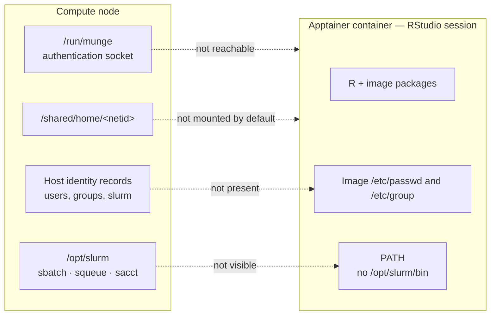
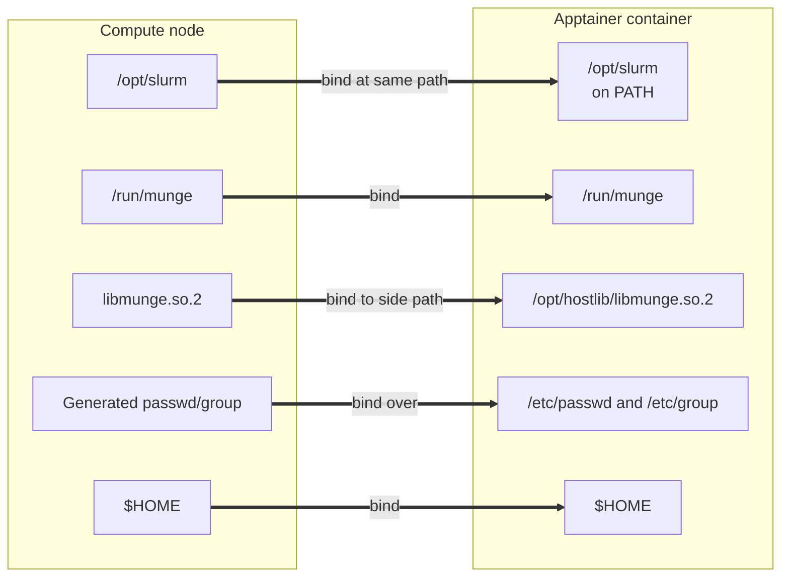
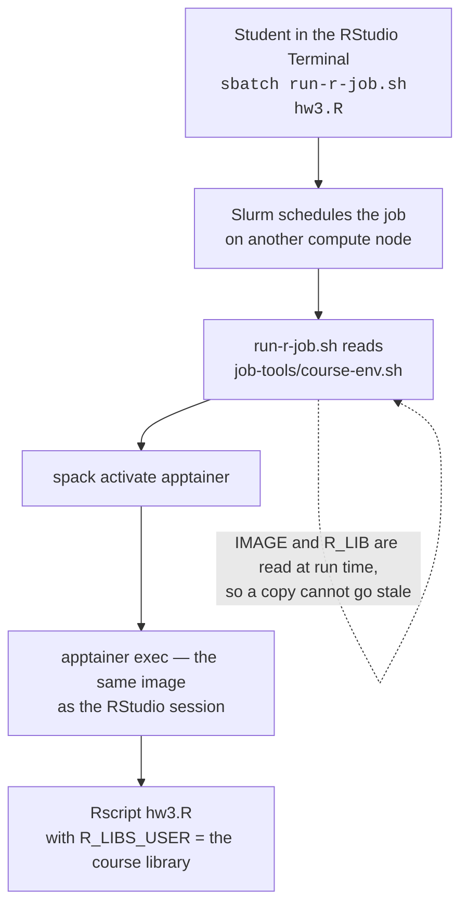

# Slurm from inside the container

**Companion to [README.md](README.md).**

The main README explains how this app runs RStudio Server in an Apptainer
container. This document explains one optional addition: allowing users to
submit and query Slurm jobs from inside that container.

This feature is intended for courses that want students to work interactively
in RStudio and submit longer-running work to the cluster without changing to a
different R environment.

Most of this document describes shared app behavior, not per-course work. The
implementation lives in:

```text
template/script.sh.erb
```

A course enables it with a single sub-app setting.

Worked example: [STAT 139](https://github.com/Harvard-ATG/ood-misc-runbooks/blob/main/courses/stat139.md).

## What a course configures

A Slurm-enabled course needs these values in:

```text
local/<course>.yml.erb
```

| Attribute | Purpose |
|---|---|
| `slurm_enabled: "true"` | Enables the Slurm integration |
| `imagefile` | Selects the RStudio image and therefore the R version used in batch jobs |
| `r_libpath` | Selects the course-managed R package library |

`imagefile` and `r_libpath` may already exist for a course using a shared R
library. `slurm_enabled` is the Slurm-specific switch.

> **Important:** List these values under both `attributes:` and `form:`. Open
> OnDemand passes only `form:`-listed values into `context`. If an attribute is
> omitted from `form:`, an ERB conditional silently evaluates as false. There is
> no error and no log line. A hard-coded value listed under `form:` is still
> hidden from the user in the dashboard.

The course does not need to create its own bind mounts, identity files, or
wrapper scripts. The shared app creates those automatically at session startup.

## Why anything is needed

RStudio runs inside an Apptainer container. The container contains R, RStudio,
and packages included in the image.

That consistency is useful: every student starts with the same R version and
the same base package versions.

It also creates a boundary. Slurm and several services required by Slurm live
outside the container, on the compute node. The container cannot use them until
the app makes them visible.

Three things are missing by default:

1. **The Slurm commands**, such as `sbatch`, `squeue`, and `sacct`.
2. **The Munge socket**, which Slurm uses to authenticate a request.
3. **The identity files**, which translate usernames and group names into the
   numeric IDs used by Unix and Slurm.

None of these is a permissions problem. The required resources exist on the
compute node, but the container cannot see them by default.



## Identity files: names and numbers

People use names; Unix uses numbers.

The files `/etc/passwd` and `/etc/group` translate between the two:

- `/etc/passwd` maps usernames to numeric user IDs and primary group IDs.
- `/etc/group` maps group names to numeric group IDs and group membership.

The names and numbers below are illustrative.

Suppose a student named **Maya Chen** has the NetID `mch247`:

```text
mch247:*:54321:1025173:Maya Chen:/shared/home/mch247:/bin/bash
```

This entry says that:

- Maya's username is `mch247`;
- her numeric user ID is `54321`;
- her primary group ID is `1025173`;
- her home directory is `/shared/home/mch247`.

A course staff group might look like:

```text
canvas170320-staff-1168564:*:1168564:jgx375,zil005
```

Slurm also needs a service account. Its configuration includes:

```text
SlurmUser=slurm
```

Before a Slurm client can start, it needs to resolve `slurm` to a numeric user
ID. It also needs to resolve the user submitting the job and that user's
groups.

The image has its own `/etc/passwd` and `/etc/group`, created when the image
was built. Those files contain only the accounts the image was built with. They
do not contain the current user, the course groups, or the `slurm` service
account. The lookup finds nothing, and no Slurm command runs at all.

The app therefore creates merged identity files at session startup:

```bash
apptainer exec "$_IMG" cat /etc/passwd > "$WORKING_DIR/passwd"
apptainer exec "$_IMG" cat /etc/group  > "$WORKING_DIR/group"

getent passwd slurm munge "$(id -un)" >> "$WORKING_DIR/passwd"
getent group  slurm munge              >> "$WORKING_DIR/group"

for _g in $(id -Gn); do
  getent group "$_g" >> "$WORKING_DIR/group"
done
```

The generated files are bound over the container's `/etc/passwd` and
`/etc/group`.

> `$(id -un)` is required. Binding a replacement `/etc/passwd` hides the
> entry Apptainer normally supplies for the launching user. If the launching
> user is omitted, the session has a numeric UID without a matching name.

### Optional: resolve the whole course roster

By default, a session can resolve the launcher and required service accounts.
A staff member running `squeue` therefore sees other users as numeric IDs.

If staff need usernames for all course members, build a roster on the portal
and resolve each username individually during session startup:

```bash
_ROSTER="<%= course_roster %>"
[ -n "$_ROSTER" ] && getent passwd $_ROSTER >> "$WORKING_DIR/passwd"
```

Build the roster in ERB on the portal. Group enumeration is incomplete on
compute nodes: the same group returned 179 names on the portal and 1 name on a
compute node, because SSSD enumeration is off. Per-user `getent passwd <netid>`
lookups work reliably everywhere.

Take the group name from the course folder's own group ownership. No extra
attribute is needed.

## Munge authentication

Munge is the authentication service used by Slurm.

The container does not claim to be Maya Chen, `mch247`, or any other user.
Instead, the Slurm client asks the local Munge daemon to identify the process.

The sequence is:

1. Open OnDemand starts the interactive session on a compute node as the
   launching user.
2. The RStudio container inherits that real user identity from the host.
3. A user runs `sbatch` from the RStudio Terminal.
4. `sbatch` contacts the host's Munge daemon through
   `/run/munge/munge.socket.2`.
5. Munge obtains the calling process's UID and GID from the kernel.
6. Munge returns a short-lived signed credential.
7. Slurm verifies the credential and schedules the job as the submitting user.

The container receives only the Munge socket. It does not receive the Munge
signing key.

| Resource | Role |
|---|---|
| `/run/munge` | The connection point: where the Slurm client asks Munge for a credential |
| `libmunge.so.2` | The client library: how the Slurm client speaks the Munge protocol |
| `/etc/passwd` and `/etc/group` | The identity map: how names such as `slurm` and `mch247` resolve to numbers |

Binding the socket does not grant extra permissions. It lets Munge report the
identity that the process already has on the host. A student's job is scheduled
against their own user ID whether or not any of this is bound, which is also why
removing a name from `/etc/passwd` would not stop them submitting. It would only
stop `squeue` printing a name.

## Bind mounts

The app makes the following resources visible inside the container.

| Bind | Why it is needed |
|---|---|
| `/opt/slurm` | Slurm client binaries, configuration, libraries, and plugins |
| `/run/munge` | Munge authentication socket |
| `$MUNGELIB:/opt/hostlib/libmunge.so.2` | Munge client library, mounted at a side path |
| `$WORKING_DIR/passwd:/etc/passwd` | Merged user identity file |
| `$WORKING_DIR/group:/etc/group` | Merged group identity file |
| `$HOME` | User files and personal R package library |

`/opt/slurm` is mounted at the same path as the host. Slurm plugins load by
absolute path, so changing the in-container location breaks the client.

Resolve the Munge library at runtime because its exact path varies. The patch
level differs between machines:

```bash
MUNGELIB=$(readlink -f /usr/lib64/libmunge.so.2)
```

Bind it under `/opt/hostlib` rather than over a system library directory in the
image. This prevents the host library from accidentally replacing unrelated
libraries in the container.



## Making resources discoverable

A bind makes a file exist inside the container. It does not necessarily make
the file easy for a command to find.

The startup script sets:

```bash
export APPTAINERENV_APPEND_PATH="/opt/slurm/bin"
export APPTAINERENV_LD_LIBRARY_PATH="/opt/slurm/lib:/opt/hostlib:${LD_LIBRARY_PATH}"
export APPTAINERENV_SLURM_CONF="/opt/slurm/etc/slurm.conf"
```

RStudio rebuilds parts of its environment when it starts a Terminal or an R
session. The settings above are therefore not enough by themselves.

The app also:

- binds a `/etc/profile.d/` drop-in so interactive Terminal shells get the
  Slurm path; and
- exports the needed `PATH` inside generated `rsession.sh` so R commands such
  as `system("sbatch myjob.sh")` work.

If `/opt/slurm/bin/sbatch` exists but `sbatch` says `command not found`, check
the environment and `PATH`, not the bind itself. A useful tell is that
`/usr/lib/rstudio-server/bin` is missing from `PATH` too, although the app
prepends it explicitly.

## Course-facing batch-job tools

Enabling Slurm gives a session working `sbatch` commands. It does not by itself
give students a supported way to run R on a separate compute node.

A batch job must:

1. activate Spack so it can find `apptainer`;
2. run the same image used by the RStudio session;
3. set the course R package library inside that image.

Two of those three values live on the sub-app form, where no student can see
them. The app therefore generates course-facing job tools in:

```text
<course shared folder>/job-tools/
├── run-r-job.sh
├── course-env.sh
└── README.md
```

| File | Purpose |
|---|---|
| `run-r-job.sh` | Wrapper that starts Apptainer and runs `Rscript` |
| `course-env.sh` | Current course image and R library values |
| `README.md` | Student-facing instructions |

The layout is deliberately course-agnostic: same folder name, same file names,
same instruction to a student, whatever the course and whatever the language. A
Python course would carry `run-py-job.sh`, generated from `run-py-job.sh.erb`.
Only the values inside differ.

The wrapper contains the mechanism. `course-env.sh` contains the values:

```bash
IMAGE=/shared/apptainerImages/<image>.sif
R_LIB=<course shared folder>/R/x86_64-pc-linux-gnu-library/<R version>
```

The three course files are ERB templates under `template/`, so Open OnDemand
renders them at session start with the rest of the app and stages them into the
session directory. `script.sh` then copies them into the course folder. Nothing
does its own substitution.

```erb
<%- _image = "/shared/apptainerImages/#{context.imagefile}" -%>
IMAGE=<%= _image %>
R_LIB=<%= _rlib %>
COURSE_ENV=<%= _tools %>/course-env.sh

[ -r "$COURSE_ENV" ] && . "$COURSE_ENV"
```

The course folder is derived from `r_libpath` rather than carried as its own
attribute: `r_libpath` is `<course folder>/R/<arch>-library/<version>`, so the
part before `/R/` is the folder.

This design lets a student copy `run-r-job.sh` once while still receiving later
updates to the image or course library path. A copy taken in week 2 uses week
9's image, and the student does nothing to get it.

The embedded values are a fallback for early testing, before the course shared
folder exists. Every course starts in that state.



### Why the canonical files live in the course folder

The course folder holds the maintained, read-only-for-students copy.

Students are expected to copy and modify their own job scripts. They are not
expected to maintain the course wrapper. A shared canonical copy means there
is always a known-good version available.

A file in a home directory cannot do this job, because it has to be two things
at once: the class's supported copy, and that person's own file. Those want
opposite maintenance rules. Refresh it and a student's edits are destroyed.
Preserve their edits and it silently goes stale.

The write behavior is intentionally different for three launchers:

| Launcher | Course `job-tools/` | Launcher's home |
|---|---|---|
| Staff or faculty able to write the course folder | Refresh on launch | Do not write |
| Admin or development staff | Do not modify | Write `run-r-job-<sub-app>-test.sh`, for testing |
| Student | Do not modify | Do not write |

Use write access to the course folder as the staff test:

```bash
[ -w "$COURSE_DIR" ]
```

This measures the capability that matters without maintaining a separate
hard-coded staff list.

The two checks run independently rather than as an `if/elif` chain, because one
person can be both staff and an admin. The admin branch is not a nicety: the
dev team usually launches a course before its folder exists or before Grouper
has propagated, so without it there would be nothing to test with.

### Student workflow

Students should work in a directory they own:

```bash
cp ~/<canvas-id>/job-tools/run-r-job.sh .
sbatch run-r-job.sh my_script.R
```

They can override Slurm defaults on the command line:

```bash
sbatch -c 4 -t 02:00:00 -J hw3 run-r-job.sh my_script.R
```

Slurm options must come before the wrapper name. Options placed after the
wrapper are passed to the wrapper as ordinary arguments and are ignored without
an obvious error. The job still completes, which is what makes the mistake hard
to spot. The wrapper warns when it sees one.

Nothing has to be configured to name a job. Open OnDemand names the session's
Slurm job after the sub-app file, so `${SLURM_JOB_NAME##*/}` is the sub-app
name.

## Why the wrapper is required

The wrapper exists to control which R runs the job.

The library path is not the problem. `R_LIBS_USER` is set in the session
environment, and `sbatch` defaults to `--export=ALL`, so a direct submission
inherits it. The job finds the course library and `.libPaths()` is correct.

The R is the problem. The compute node has its own system R at `/usr/lib64/R`.
Course packages with compiled code are built against the R version inside the
RStudio image. A job that runs under the system R can therefore find a package
and still fail to load it:

```text
Error: package or namespace load failed for 'digest' in dyn.load(...):
  undefined symbol: NO_REFERENCES

package 'digest' was built under R version 4.5.0
```

The wrapper starts Apptainer inside the batch job and runs the script in the
same image used by RStudio.

> The library path tells R where the package is. The container provides an R
> version that can load it.

There is a second reason, and it is about where the job is submitted from.

A Terminal pane inside RStudio has `R_LIBS_USER`, because this app's session
sets it and `sbatch` passes it on. Open OnDemand's own shell app does not,
because that is a different app and nothing set it there.

The job gets the course library either way. The wrapper does not read
`R_LIBS_USER` from the environment. It builds the value itself and passes it to
the container:

```bash
_R_LIBS="$HOME/R/%p-library/%v:$R_LIB"
apptainer exec $_BINDS --env R_LIBS_USER="$_R_LIBS" "$IMAGE" Rscript "$@"
```

**Both libraries, in the order the RStudio session uses them** — the user's own
first, the course library second. Passing only the course library would replace
the user's rather than add to it, and a package a student installed themselves
would then load in the console and fail in their job. Nothing would explain the
difference: the path is simply present in one `.libPaths()` and absent from the
other. R expands `%p` and `%v` itself, so the value stays correct across image
upgrades, and R drops a path that does not exist without complaining.

So `sbatch run-r-job.sh my_script.R` finds the course packages from the RStudio
Terminal, from the shell app, or from anywhere else. Only a bare `sbatch`
depends on where it was submitted from.

## Troubleshooting

<details>
<summary><strong>Every Slurm command fails with <code>Invalid user for SlurmUser slurm</code></strong></summary>

**Cause:** The Slurm client cannot resolve the `slurm` service account because
the image's `/etc/passwd` does not contain it. The client refuses to start at
all, with `fatal: Unable to process configuration file`.

**Check:** Inspect the generated passwd file and confirm it includes `slurm`
and the launching user.

**Fix:** Generate merged passwd and group files, then bind them over the
container's `/etc/passwd` and `/etc/group`.
</details>

<details>
<summary><strong>The Slurm injection block does nothing</strong></summary>

**Cause:** `slurm_enabled` is present under `attributes:` but absent from
`form:`. The value never reaches `context`, so the ERB guard evaluates false.

**Fix:** List the value under both `attributes:` and `form:`. This is the
easiest mistake to make and the hardest to spot, because there is no error.
</details>

<details>
<summary><strong><code>sbatch: command not found</code>, but <code>/opt/slurm/bin/sbatch</code> exists</strong></summary>

**Cause:** The bind worked, but RStudio's reconstructed Terminal or R-session
environment does not include `/opt/slurm/bin` in `PATH`.

**Fix:** Confirm the profile drop-in is bound for Terminal shells and the
generated `rsession.sh` exports the required path for the R console.
</details>

<details>
<summary><strong>Batch jobs cannot see files in the user's home directory</strong></summary>

**Cause:** Apptainer creates an empty home directory when the node-reported
home path does not match the real shared home path. The compute nodes report
homes as `/home/<netid>` while the real path is `/shared/home/<netid>`, so
Apptainer has nothing valid to mount. Relative paths still work because the job
working directory is available, which hides the problem.

**Fix:** Explicitly bind `$HOME`, guarded against an unset or invalid value:

```bash
[ -n "$HOME" ] && [ -d "$HOME" ] && _BINDS="$_BINDS -B $HOME"
```

This bind also makes the user's own R package library under `$HOME/R/...`
available inside batch jobs. The problem is not specific to any one course: any
Apptainer app running a plain `apptainer exec` on these nodes has it.
</details>

<details>
<summary><strong>A job sees the course library but cannot load a compiled package</strong></summary>

**Cause:** The job is using the compute node's system R instead of the R inside
the course container.

**Fix:** Submit through `run-r-job.sh`, which starts the configured Apptainer
image and runs `Rscript` inside it.
</details>

## Reference

- Open OnDemand passes only `form:`-listed attributes into `context`.
- `template/` files are staged into `${JOBROOT}`; `before.sh` sets
  `export JOBROOT=$PWD`.
- Use shared image paths. A node-local image cache may not exist on the node
  selected for the batch job.
- R silently drops nonexistent package-library paths from `.libPaths()`, so the
  order of provisioning does not matter.
- The portal cannot submit Slurm jobs; it cannot contact `slurmctld`. Submit
  from the head node or from an app session.
- `sudo` resets `PATH`. Use `/opt/slurm/bin/sbatch` under `sudo -u`.
- Group enumeration works on the portal and not on compute nodes. Per-name
  lookups work everywhere.
