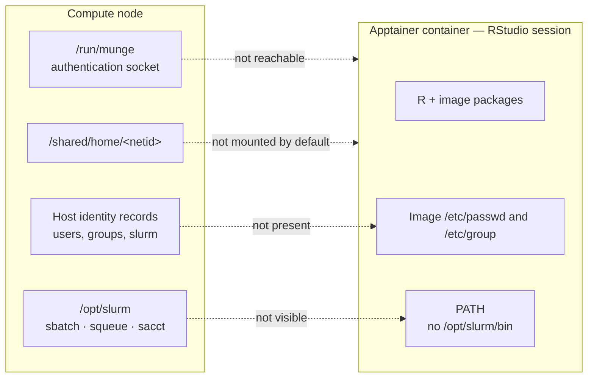
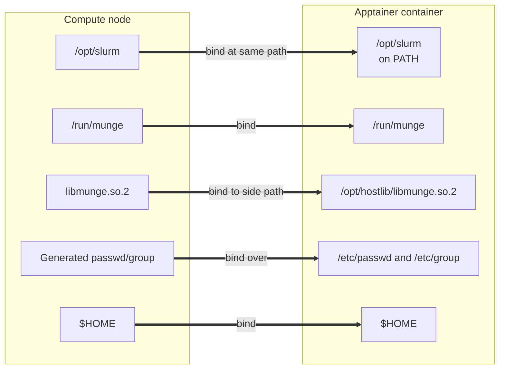
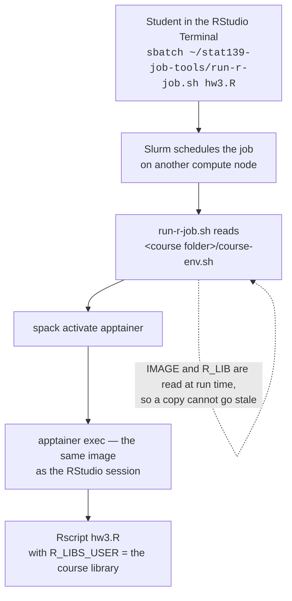

# Slurm from inside the container

**Companion to [README.md](README.md).**

The main README explains how this app runs RStudio Server in an Apptainer
container. This document explains one optional addition: allowing users to
submit and query Slurm jobs from inside that container.

This feature is intended for courses that want students to work interactively
in RStudio and submit longer-running work to the cluster without changing to a
different R environment.

Most of this document describes shared app behavior, not per-course work. The
implementation lives in:

```text
template/script.sh.erb
```

A course enables it with a single sub-app setting.

Worked example: [STAT 139](https://github.com/Harvard-ATG/ood-misc-runbooks/blob/main/courses/stat139.md).

## What a course configures

A Slurm-enabled course needs these values in:

```text
local/<course>.yml.erb
```

| Attribute | Purpose |
|---|---|
| `slurm_enabled: "true"` | Enables the Slurm integration |
| `imagefile` | Selects the RStudio image and therefore the R version used in batch jobs |
| `r_libpath` | Selects the course-managed R package library |
| `course_slug` | Names the job-tools folder in each user's home, the Slurm job, and the output file |

`imagefile` and `r_libpath` may already exist for a course using a shared R
library. `slurm_enabled` and `course_slug` are the Slurm-specific ones.

`course_slug` is a short course name in the same style as the sub-app file —
`stat139` for `local/stat139.yml.erb`. It produces `~/stat139-job-tools/`, a job
named `stat139`, and output in `stat139-<jobid>.out`. Leave it out and everything
falls back to the sub-app file name, which is usually the same thing.

> **Important:** List these values under both `attributes:` and `form:`. Open
> OnDemand passes only `form:`-listed values into `context`. If an attribute is
> omitted from `form:`, an ERB conditional silently evaluates as false. There is
> no error and no log line. A hard-coded value listed under `form:` is still
> hidden from the user in the dashboard.

The course does not need to create its own bind mounts, identity files, or
wrapper scripts. The shared app creates those automatically at session startup.

## Why anything is needed

RStudio runs inside an Apptainer container. The container contains R, RStudio,
and packages included in the image.

That consistency is useful: every student starts with the same R version and
the same base package versions.

It also creates a boundary. Slurm and several services required by Slurm live
outside the container, on the compute node. The container cannot use them until
the app makes them visible.

Three things are missing by default:

1. **The Slurm commands**, such as `sbatch`, `squeue`, and `sacct`.
2. **The Munge socket**, which Slurm uses to authenticate a request.
3. **The identity files**, which translate usernames and group names into the
   numeric IDs used by Unix and Slurm.

None of these is a permissions problem. The required resources exist on the
compute node, but the container cannot see them by default.



## Identity files: names and numbers

People use names; Unix uses numbers.

The files `/etc/passwd` and `/etc/group` translate between the two:

- `/etc/passwd` maps usernames to numeric user IDs and primary group IDs.
- `/etc/group` maps group names to numeric group IDs and group membership.

The names and numbers in this example are illustrative.

Suppose a student named **Maya Chen** has the NetID `mch247`:

```text
mch247:*:54321:1025173:Maya Chen:/shared/home/mch247:/bin/bash
```

This entry says that:

- Maya's username is `mch247`;
- her numeric user ID is `54321`;
- her primary group ID is `1025173`;
- her home directory is `/shared/home/mch247`.

A course staff group might look like:

```text
canvas170320-staff-1168564:*:1168564:jgx375,zil005
```

Slurm also needs a service account. Its configuration includes:

```text
SlurmUser=slurm
```

Before a Slurm client can start, it needs to resolve `slurm` to a numeric user
ID. It also needs to resolve the user submitting the job and that user's
groups.

The image has its own `/etc/passwd` and `/etc/group`, created when the image
was built. Those files contain only the accounts the image was built with. They
do not contain the current user, the course groups, or the `slurm` service
account. The lookup finds nothing, and no Slurm command runs at all.

The app therefore creates merged identity files at session startup:

```bash
apptainer exec "$_IMG" cat /etc/passwd > "$WORKING_DIR/passwd"
apptainer exec "$_IMG" cat /etc/group  > "$WORKING_DIR/group"

getent passwd slurm munge "$(id -un)" >> "$WORKING_DIR/passwd"
getent group  slurm munge              >> "$WORKING_DIR/group"

for _g in $(id -Gn); do
  getent group "$_g" >> "$WORKING_DIR/group"
done
```

The generated files are bound over the container's `/etc/passwd` and
`/etc/group`.

> `$(id -un)` is required. Binding a replacement `/etc/passwd` hides the
> entry Apptainer normally supplies for the launching user. If the launching
> user is omitted, the session has a numeric UID without a matching name.

### Optional: resolve the whole course roster

By default, a session can resolve the launcher and required service accounts.
A staff member running `squeue` therefore sees other users as numeric IDs.

If staff need usernames for all course members, build a roster on the portal
and resolve each username individually during session startup:

```bash
_ROSTER="<%= course_roster %>"
[ -n "$_ROSTER" ] && getent passwd $_ROSTER >> "$WORKING_DIR/passwd"
```

Build the roster in ERB on the portal. Group enumeration is incomplete on
compute nodes: the same group returned 179 names on the portal and 1 name on a
compute node, because SSSD enumeration is off. Per-user `getent passwd <netid>`
lookups work reliably everywhere.

Take the group name from the course folder's own group ownership. No extra
attribute is needed.

## Munge authentication

Munge is the authentication service used by Slurm.

The container does not claim to be Maya Chen, `mch247`, or any other user.
Instead, the Slurm client asks the local Munge daemon to identify the process.

The sequence is:

1. Open OnDemand starts the interactive session on a compute node as the
   launching user.
2. The RStudio container inherits that real user identity from the host.
3. A user runs `sbatch` from the RStudio Terminal.
4. `sbatch` contacts the host's Munge daemon through
   `/run/munge/munge.socket.2`.
5. Munge obtains the calling process's UID and GID from the kernel.
6. Munge returns a short-lived signed credential.
7. Slurm verifies the credential and schedules the job as the submitting user.

The container receives only the Munge socket. It does not receive the Munge
signing key.

| Resource | Role |
|---|---|
| `/run/munge` | The connection point: where the Slurm client asks Munge for a credential |
| `libmunge.so.2` | The client library: how the Slurm client speaks the Munge protocol |
| `/etc/passwd` and `/etc/group` | The identity map: how names such as `slurm` and `mch247` resolve to numbers |

Binding the socket does not grant extra permissions. It lets Munge report the
identity that the process already has on the host. A student's job is scheduled
against their own user ID whether or not any of this is bound, which is also why
removing a name from `/etc/passwd` would not stop them submitting. It would only
stop `squeue` printing a name.

## Bind mounts

The app makes the following resources visible inside the container.

| Bind | Why it is needed |
|---|---|
| `/opt/slurm` | Slurm client binaries, configuration, libraries, and plugins |
| `/run/munge` | Munge authentication socket |
| `$MUNGELIB:/opt/hostlib/libmunge.so.2` | Munge client library, mounted at a side path |
| `$WORKING_DIR/passwd:/etc/passwd` | Merged user identity file |
| `$WORKING_DIR/group:/etc/group` | Merged group identity file |
| `$HOME` | User files and personal R package library |

`/opt/slurm` is mounted at the same path as the host. Slurm plugins load by
absolute path, so changing the in-container location breaks the client.

Resolve the Munge library at runtime because its exact path varies. The patch
level differs between machines:

```bash
MUNGELIB=$(readlink -f /usr/lib64/libmunge.so.2)
```

Bind it under `/opt/hostlib` rather than over a system library directory in the
image. This prevents the host library from accidentally replacing unrelated
libraries in the container.



## Making resources discoverable

A bind makes a file exist inside the container. It does not necessarily make
the file easy for a command to find.

The startup script sets:

```bash
export APPTAINERENV_APPEND_PATH="/opt/slurm/bin"
export APPTAINERENV_LD_LIBRARY_PATH="/opt/slurm/lib:/opt/hostlib:${LD_LIBRARY_PATH}"
export APPTAINERENV_SLURM_CONF="/opt/slurm/etc/slurm.conf"
```

RStudio rebuilds parts of its environment when it starts a Terminal or an R
session. The `APPTAINERENV_` exports are therefore not enough by themselves.

The app also:

- binds a `/etc/profile.d/` drop-in so interactive Terminal shells get the
  Slurm path; and
- exports `PATH` inside the generated `rsession.sh`.

**The second does not reach R.** Measured 2026-09-10: RStudio replaces `PATH`
for the session after that wrapper runs, so `Sys.getenv("PATH")` in the console
holds RStudio's own directories and nothing of Slurm's.

From the R console, a bare call fails. Include the path and it works:

```r
system("sbatch ...")                     # fails - not on R's PATH
system("/opt/slurm/bin/sbatch ~/stat139-job-tools/run-r-job.sh hw3.R")   # works
```

The Terminal pane needs no path, because login shells source the `profile.d`
drop-in. That is the route the student documentation gives.

If `/opt/slurm/bin/sbatch` exists but `sbatch` says `command not found`, check
the environment and `PATH`, not the bind itself. A useful tell is that
`/usr/lib/rstudio-server/bin` is missing from `PATH` too, although the app
prepends it explicitly.

## Course-facing batch-job tools

Enabling Slurm gives a session working `sbatch` commands. It does not by itself
give students a supported way to run R on a separate compute node.

A batch job must:

1. activate Spack so it can find `apptainer`;
2. run the same image used by the RStudio session;
3. set the course R package library inside that image.

Two of those three values live on the sub-app form, where no student can see
them. The app therefore generates job tools into each user's own home directory:

```text
~/<course-slug>-job-tools/           e.g. ~/stat139-job-tools/
├── run-r-job.sh
└── README.md
```

| File | Purpose |
|---|---|
| `run-r-job.sh` | Wrapper that starts Apptainer and runs `Rscript` |
| `README.md` | Student-facing instructions |

`<course-slug>` comes from the `course_slug` attribute on the sub-app form. It is
carried rather than derived: deriving it from `r_libpath` would give the Canvas
id, and `~/<canvas-id>` is already taken by the symlink to the read-only course
folder — so `mkdir -p ~/170320/job-tools` fails.

The folder is flat rather than `~/<course-slug>/job-tools/`. A home directory is
shared by every course a person is in, so the folder has to carry the course name
either way; once it does, a second level only makes the path longer to type.

The layout is course-agnostic: same shape, same file names, same instruction to a
student, whatever the course and whatever the language. A Python course would
carry `run-py-job.sh`, generated from `run-py-job.sh.erb`. Only the values inside
differ.

### What is refreshed, and what is left alone

The folder is rewritten on **every launch, for every user** — student, staff and
admin alike. There is no write test and no per-role branch: the destination is
the user's own home, so writability is not in question, and a student who never
receives a copy has nothing to run.

Only `run-r-job.sh` and `README.md` are replaced. Everything else in that
folder is left alone.

That is what makes the supported instruction safe: a user can copy the wrapper,
rename the copy, and edit that. `run-my-job.sh` is never touched. Editing
`run-r-job.sh` in place loses the change at the next launch, with no warning,
which is why the wrapper's own header says so first, in a box, before anything
else:

```bash
cp ~/stat139-job-tools/run-r-job.sh run-my-job.sh
```

A student needs no copy at all in order to run a job. The wrapper is submitted by
path, from wherever they are working:

```bash
sbatch ~/stat139-job-tools/run-r-job.sh hw3.R
```

Copying is for people who want to change it.

### Where the values live

The wrapper carries the mechanism. `course-env.sh` carries the values, and it
lives in the **course folder**, not in anyone's home:

```bash
IMAGE=/shared/apptainerImages/<image>.sif
R_LIB=<course shared folder>/R/x86_64-pc-linux-gnu-library/<R version>
```

The wrapper reads it at run time:

```erb
<%- _image = "/shared/apptainerImages/#{context.imagefile}" -%>
IMAGE=<%= _image %>
R_LIB=<%= _rlib %>
COURSE_ENV=<%= _course %>/course-env.sh

[ -n "$COURSE_ENV" ] && [ -r "$COURSE_ENV" ] && . "$COURSE_ENV"
```

The course folder is derived from `r_libpath`: `r_libpath` is
`<course folder>/R/<arch>-library/<version>`, so the part before `/R/` is the
folder.

That one file in one shared place is what lets a copy a student took in week 2
run under week 9's image without the student doing anything. The `IMAGE` and
`R_LIB` assignments in the wrapper are a fallback for a course being tested
before its folder is provisioned; every course starts in that state.

> **`course-env.sh` is written by provisioning, not by a session.** It belongs to
> the course rather than to any one person, so no launch writes it —
> `scripts/provision-course-env.sh` does, once per course. Until it has been run
> the file is simply absent and the baked-in fallbacks apply, which is correct but
> freezes the values at render time. See
> [Provisioning the course environment](#provisioning-the-course-environment).

### Provisioning the course environment

A Slurm-enabled course runs R in two places: the RStudio session, and the batch
job submitted from it. Both have to use the same container image and the same R
package library, or a package built under one fails to load under the other.
`course-env.sh` names the image file and the path to the course R library, in a
single file in the course folder.

When a student submits a job with the `run-r-job.sh` wrapper, it reads
`course-env.sh` as the job starts and takes the image and library paths from it,
rather than carrying its own copies. So editing the image in `course-env.sh`
changes what every job uses from its next run onward — including jobs submitted
with a wrapper a student copied in week 2. If `course-env.sh` is missing, the
wrapper falls back to the image and library paths written into it when that
student's session was rendered, and keeps them for as long as that copy exists.

**Provisioning is a course setup step, done before the course is in use.** It
creates the R package library directory that staff install into, and writes
`course-env.sh` beside it in the course folder. `course-env.sh` records which
package library and which container image a batch job should use for this
course.

It has a place in the order of setup. The course folder has to exist first,
which happens when a course member first logs in and `/etc/ood/add_user.sh`
creates it. Provisioning comes after the course folder exists, and before
faculty and students start launching sessions and submitting jobs.

`scripts/provision-course-env.sh` is run **by hand, as root on the head node,
once per course that enables Slurm**. There are no hooks — not in this app, not
in user setup, not on merge — so it belongs on the course setup checklist,
alongside the sub-app form.

Root is the requirement rather than a convenience: the outer course folder is
`750` and owned by the enrollment group, so an administrator outside the course
groups cannot traverse into it at all.

`--dry-run` prints the paths it resolved and the file it would write, and changes
nothing:

```bash
scripts/provision-course-env.sh --canvas-id <id> --image <imagefile> --dry-run
scripts/provision-course-env.sh --canvas-id <id> --image <imagefile>

# Example — STAT 139:
# scripts/provision-course-env.sh --canvas-id 170320 --image rstudio-base.sif --dry-run
# scripts/provision-course-env.sh --canvas-id 170320 --image rstudio-base.sif
```

| Flag | Purpose |
|---|---|
| `--canvas-id` | Required. The course folder is derived from it |
| `--image` | Required. A filename under the image root, not a path |
| `--r-version` | Defaults to `4.5`. Must match the image's R |
| `--arch` | Defaults to `x86_64-pc-linux-gnu` |
| `--dry-run` | Print and exit |

It creates the R library inside the course folder, at
`<course folder>/R/<arch>-library/<r-version>`, if no library is there already,
and sets it setgid so packages staff install later stay readable to students. An
existing library at that path is left alone. It then writes `course-env.sh` into
the course folder itself, beside the `R` directory. Re-running is the intended
way to move a course to a new image.

The script's own header and comments carry the implementation detail.

#### Where it fails

The checks run before anything is written. Where one fails the script prints an
`ERROR:` line naming the problem, exits non-zero, and leaves the course folder
untouched — no library created, no `course-env.sh` written.

| Situation | What happens |
|---|---|
| The course folder does not exist | Stops. The folder is created by `/etc/ood/add_user.sh`, not by this script. That runs automatically at a course member's first login, and can also be run by hand as root on the portal for a member who has not logged in yet. Create the folder that way, then rerun |
| The image is not readable | Stops |
| The R inside the image reports a different version than `--r-version` | Stops. The library path ends in the R version, so building the library against one version and running jobs under another would orphan every package in it |
| `apptainer` cannot be found | Carries on. The R version check is skipped and `--r-version` is taken on trust, with a log line saying so |
| The library is created but its mode cannot be set | Carries on. `course-env.sh` is still written, but the script exits non-zero and prints a `WARNING:` line, so packages staff install may not stay readable to students until the mode is fixed |

Verify from a session afterwards:

```bash
sbatch ~/<course>-job-tools/run-r-job.sh <script>.R
```

A course that is never provisioned still works, which is what makes this easy to
miss. With no `course-env.sh` to read, the `run-r-job.sh` wrapper uses the
`IMAGE` and `R_LIB` values written into it when the session rendered. For
STAT 139 those are:

```bash
IMAGE=/shared/apptainerImages/rstudio-base.sif
R_LIB=/shared/courseSharedFolders/170320outer/170320/R/x86_64-pc-linux-gnu-library/4.5
```

Jobs run correctly against them, so nothing looks wrong. The cost only shows up
when one of the values has to change. The `run-r-job.sh` wrapper that Open
OnDemand installs is rewritten at every launch, so it picks up a new image the
next time the student opens RStudio. A copy the student made keeps whatever it
was given. Change the course image in the form, and every copy keeps running
the old one until each student copies the wrapper again.

With `course-env.sh` in place, neither has to be recopied: both read the current
values from the course folder on the next job.



### Student workflow

From the folder the script is in:

```bash
sbatch ~/stat139-job-tools/run-r-job.sh my_script.R
cat stat139-<jobid>.out
```

Slurm defaults can be overridden on the command line:

```bash
sbatch -c 4 -t 02:00:00 -J hw3 ~/stat139-job-tools/run-r-job.sh my_script.R
```

Slurm options must come before the wrapper name. Options placed after the wrapper
are passed to the wrapper as ordinary arguments and are ignored without an obvious
error. The job still completes, which is what makes the mistake hard to spot. The
wrapper warns when it sees one.

Submit from a directory the student owns. The course folder is read-only to them,
so a job started from inside it cannot write its output.

The job is named for the course and its output file is too — `stat139` in
`squeue`, `stat139-<jobid>.out` on disk — because both come from `#SBATCH`
directives rendered from `course_slug`. Slurm's own default would be
`slurm-<jobid>.out`, which says nothing about which course produced it in a home
directory holding several.

Nothing has to be configured to name the *session's* job. Open OnDemand names it
after the sub-app file, so `${SLURM_JOB_NAME##*/}` is the sub-app name — which is
also the fallback used for the folder name if `course_slug` is ever missing from
the form.

## Why the wrapper is required

The wrapper exists to control which R runs the job.

The library path is not the problem. `R_LIBS_USER` is set in the session
environment, and `sbatch` defaults to `--export=ALL`, so a direct submission
inherits it. The job finds the course library and `.libPaths()` is correct.

The R is the problem. The compute node has its own system R at `/usr/lib64/R`.
Course packages with compiled code are built against the R version inside the
RStudio image. A job that runs under the system R can therefore find a package
and still fail to load it:

```text
Error: package or namespace load failed for 'digest' in dyn.load(...):
  undefined symbol: NO_REFERENCES

package 'digest' was built under R version 4.5.0
```

The wrapper starts Apptainer inside the batch job and runs the script in the
same image used by RStudio.

> The library path tells R where the package is. The container provides an R
> version that can load it.

There is a second reason, and it is about where the job is submitted from.

A Terminal pane inside RStudio has `R_LIBS_USER`, because this app's session
sets it and `sbatch` passes it on. Open OnDemand's own shell app does not,
because that is a different app and nothing set it there.

The job gets the course library either way. The wrapper does not read
`R_LIBS_USER` from the environment. It builds the value itself and passes it to
the container:

```bash
_R_LIBS="$HOME/R/%p-library/%v:$R_LIB"
apptainer exec --home "$HOME" $_BINDS \
  --env R_LIBS_USER="$_R_LIBS" \
  --env R_LIBS= \
  "$IMAGE" Rscript "$@"
```

**`R_LIBS_USER`** — the user's own library first, the course library second.

- Passing only the course library would replace the user's, not add to it.
- `%p` and `%v` are left for R to expand, so the value survives image upgrades.
- R drops a library path it cannot read, or that does not exist, without a word.

**`R_LIBS=`** — must be set **empty, not unset**.

- Unset, the image's `Renviron.site` puts its own libraries back in front.
- Without it the image outranks both the user's library and the course's, and
  any shared package name resolves from the image.
- Before this was set, STAT 139's course library had never served a package.
- Nothing becomes unreachable: the image's packages return through
  `R_LIBS_SITE` and `.Library`, behind the other two.

**`--home "$HOME"`** — makes `~` mean the same thing in a job as in the session.

- Apptainer otherwise takes home from the passwd entry, which on these nodes is
  not the user's home on shared storage.
- `--env HOME=` does not work: apptainer reserves the variable and refuses it.

Together these make `sbatch run-r-job.sh my_script.R` find the course packages
from the Terminal, the shell app, or anywhere else. Only a bare `sbatch`
depends on where it was submitted from.
